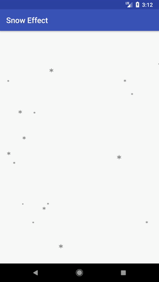

# Snow-Effect
a Android View try to implement snowfall effect.

# DEMO

# How It work

I create a custom view that invalidate perious 10 million second and draw the several drawable(snow image in this case) when view on draw.

I calculate the X and Y point of each drawable every time. so that I can let it animate like snowfall. You can see more detail in the source code.

# How To use

Copy and Past.

Sorry, I just try to implement this effect of interest. Packing a library is not in my plan.  